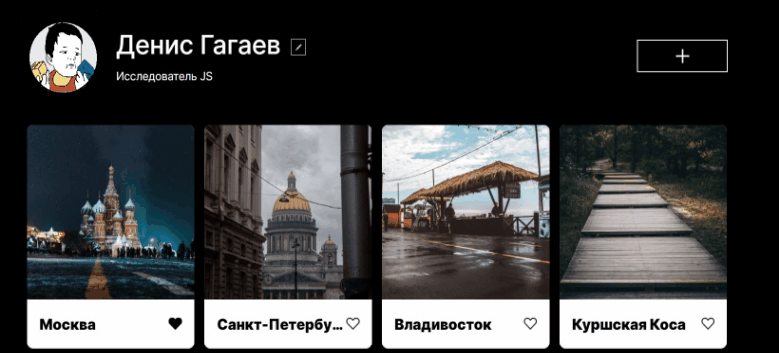

# Проект: Место
*Это третий проект в рамках обучения в [Яндекс.Практикум](https://praktikum.yandex.ru)*

  

### Обзор

- Файловая структура создана по БЭМ.
- Написан на HTML, CSS и JS
- Сверстан по макету из [figma](https://www.figma.com/file/2cn9N9jSkmxD84oJik7xL7/JavaScript.-Sprint-4?node-id=0%3A1)


### Планы по доработке:

* Добавление фото в галлерею.
* Редактирование фото и описания к ним.
* Лайки под фото.
* Приязка сайта к серверу для сохранения данных пользователя.

[Ссылка на сайт](https://denisgagaev.github.io/mesto/)

```
Сверстал Гагаев Денис.
```
